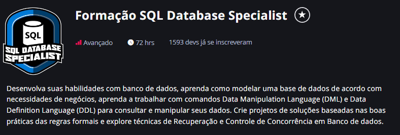

# Formação SQL Database Specialist

Este repositório tem por objetivo trazer umaa visão geral sobre a <b>Formação de analista de banco de dados SQL</b> em um nível avançado, ofertado pela DIO.me.<br />
Esta formação possui 5 módulos conforme a estrutura definida a seguir:

- Módulo 1 - Fundamento de Banco de Dados
    1. Introdução a banco de dados;
    2. sistemas de Gerenciamento de banco de dados;
    3. Modelagem de dados para banco de dados;
    4. Arquitetura de banco de dados.
- Módulo 2 - Modelagem de Entidade Relacional com Banco de Dados
    1. Fundamentos da Modelagem e Projetos de banco de dados;
    2. Modelo de Entidade relacionamento com banco de dados;
    3. Modelo relacionamento de entidade aprimorado com banco de dados.
    4. Desafio[^1].
- MÓDULO 3. Explorando a Linguagem de Consulta a Banco de Dados SQL – Structured Query Language
    1. Modelo relacional e mapeamento relacional com banco de dados;
    2. Primeiros passos com SQL;
    3. Explorando queries com SQL;
    4. Criando queries com função e cláusulas de agrupamentos;
    5. Agrupando registros com join statement;
    6. Desafio 1[^1];
    7. Desafio 2[^1].
- MÓDULO 4. Técnicas Avançadas de Banco de Dados
    1. Personalizando acessos com Views;
    2. Explorando cláusulas de DDL e esquemas de banco de dados;
    3. Explorando lógica de programação com SQL dinâmico;
    4. Overview sobre automatização de ações com triggers;
    5. Fundamentos da indexação em SGBD's;
    6. Normalização de banco de dados;
    7. Desafio 1[^1];
    8. Desafio 2[^1].
- MÓDULO 5. Técnicas de Recuperação e Controle de Concorrência em Banco de Dados
    1. Transações de banco de dados;
    2. Controle de concorrência em banco de dados;
    3. Técnicas de recuperação em banco de dados;
    4. Desafio[^1].

[^1]: Desafio do módulo pré-requisito para conclusão do curso e emissão de certificado.

A criação deste repositório, considerei trazer uma solução para pessoas que tenham dificultado com instalação de programas, e ou, não possuam um computador com capacidade para executar vários programas ao mesmo tempo. Pensando neste cenário, dentro da estrutura do repositório criei um arquivo chamado ==docker-compose.yaml==.

### Introdução para executar o arquivo yaml
- ❌ Não faça o download do projeto    ✅ Faça o fork utilizando a forma https ou ssh.
- Instale o programa docker - *[docker](https://www.docker.com)*.
- Use o editor de texto de sua preferência Gitbash or VScode para clonar o repositório via fork.
- Navegue até a pasta raiz do projeto.
- Execute o compando ```docker compose up -d```.
- Executado o arquivo e criado o container no docker em seu naegador da web digite: <localhost:3000>.
- Pronto, agora você tem o mysql workbench rodando em sua máquina pelo browser.

